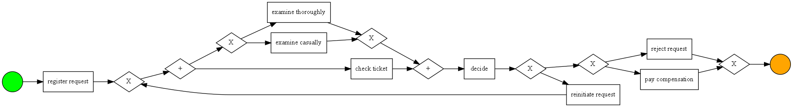
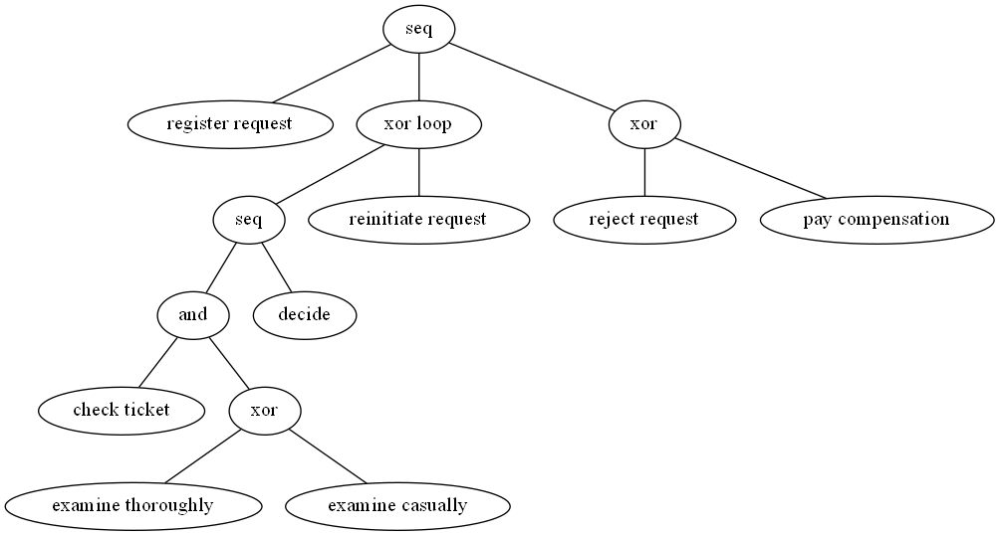
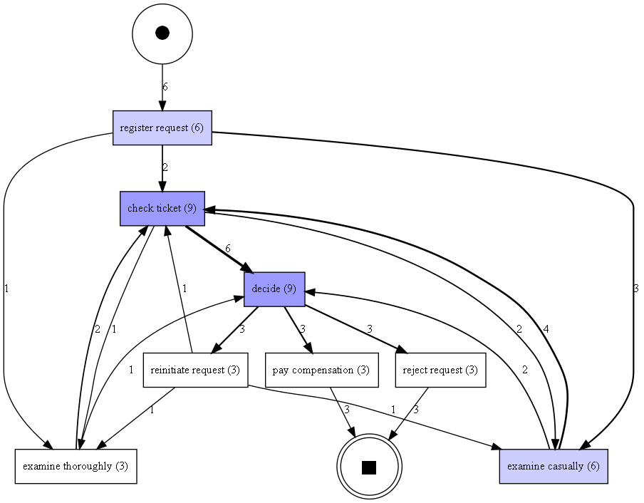
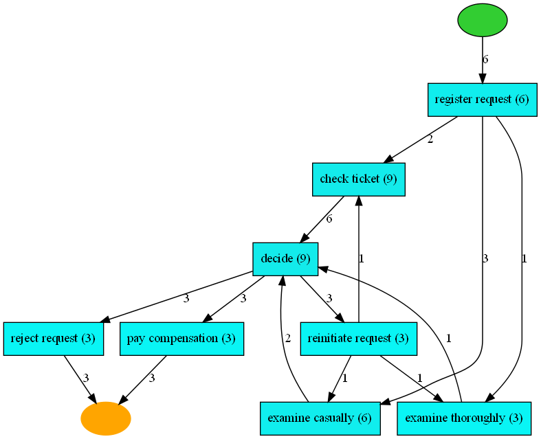

# pm4py-tutorial

본 글은 [PY4PM의 Documentation](https://pm4py.fit.fraunhofer.de/static/assets/api/2.5.0/index.html#)을 참고하여 작성 및 인용되었습니다.

## Process
프로세스 마이닝에서 `프로세스`의 정의는 다음과 같다.
> A process represents a collection of activities that we execute to achieve a certain goal
- 프로세스는 어떤 목표를 달성하기 위해 수행하는 액티비티의 모음이다.

## 프로세스 마이닝 솔루션
- 참고자료: [링크](https://www.gartner.com/reviews/market/process-mining)
- Celonis Execution Management System
- IBM Process Mining
- UiPath Platform
- Fluxicon Disco
- Scout Platform
- ARIS Process Mining 10
- SAP Signavio Process Intelligence
- iGrafx
- MPM ProcessMining
- Microsoft Process Advizer
- etc

## Data for py4pm
- file type: csv and xes(eXtensible Event Strem)
- component
  - the case for which the event occured (case ID)
  - activity
  - timestamp
  - resource executing the activity
  - etc

## 이벤트로그 읽기
### csv 읽기
- [script](https://github.com/KIMHYEMEE/pm4py-tutorial/blob/main/data%20load-save_csv.py)
- `format_dataframe`: dataframe을 pm4py에서 읽을 수 있는 형태로 설정. 이 때, case id, activity, timestamp 등의 요소를 컬럼명을 활용하여 할당하여야 함. 할당 시 해당 컬럼명은 pm4py에서 설정된 컬럼명으로 변경됨. (예, case:concept:name, concept:name, time:timestamp) 
  - 2023-02-16: 3.0 버전에서는 사용하지 않는다는 경고문 발생. 현재 관련 자료 확인 불가

1. pandas를 활용하여 dataframe으로 읽기 (df를 처리하는 방식이므로, xlsx 파일도 가능할 것으로 추정 ~ 확인 필요)
2. `format_dataframe`으로 dataframe을 이벤트로그 형태로 변환

### xes 읽기
- [script](https://github.com/KIMHYEMEE/pm4py-tutorial/blob/main/data%20load-save_xes.py)
- `read_xes`: xes파일을 읽는 함수. xes는 이벤트를 표현하는 형식의 파일이므로, 별도의 파라미터 등을 통한 구성요소 설정 작업을 필요로하지 않음

1. `read_xes`으로 xes파일 읽기

## 이벤트로그 저장하기
### csv로 저장하기
- `convert_to_dataframe`: 이벤트로그를 dataframe으로 변환

1. [선택] xes 파일로 만들어진 이벤트로그인 경우, `convert_to_dataframe`을 활용하여 dataframe 형태로 전환
   - 해당작업을 수행하지않고 이벤트로그를 바로 저장할 경우, 문제없이 저장됨
2. 일반 데이터프레임을 저장하는 것과 같이 `df.to_csv`를 활용하여 파일 저장

### xes로 저장하기
- `write_xes`: dataframe 또는 xes 에서 얻어진 이벤트로그를 xes로 저장

1. `write_xes`를 활용하여 이벤트로그를 xes로 저장

## 이벤트로그 현황 확인
- `get_start_activities` (`get_end_activities`): 이벤트로그 내 각 케이스(trace)의 시작(끝)에 발생하는 activity를 빈도수와 함께 표현

## 이벤트로그 필터
- 파라미터
  - `retain`: False인 경우, 대상 필터링 케이스를 모두 제거

- **filter_start_activities(log, activities, retrain=True)**: 제시된 액티비티를 <시작> 액티비티로 갖는 케이스를 필터링
  ```
  filtered = pm4py.filter_start_activities(event_log, {'register request'})
  ```
  ```
  filtered = pm4py.filter_start_activities(event_log, {'register request TYPO!'})
  ```
- **filter_end_activities(log, activities, retrain=True)**: 제시된 액티비티를 <종료> 액티비티로 갖는 케이스를 필터링
  ```
  filtered = pm4py.filter_end_activities(event_log, {'pay compensation'})
  ```
- **filter_event_attribute_values(log, attribute_key, values, level='case', retain=True)**: attribute_key의 값이 values의 값 중 하나를 포함하는 경우 필터링. level을 설정하지 않으면 케이스 전체가 default 이며, level이 event인 경우 케이스 전체 대신 해당 value를 포함하는 event만 필터링
  ```
  filtered = pm4py.filter_event_attribute_values(event_log, 'resource',{'Pete','Mike'})
  ```
  ```
  filtered = pm4py.filter_event_attribute_values(event_log, 'resource',{'Pete','Mike'}, level='event')
  ```
- **filter_trace_attribute_values(log, attribute_key, values, retain=True)**: trace attribute를 필터링. attribute_key는 trace를 표현하는 컬럼명이며, value는 해당 컬럼 내 필터링할 trace의 구분자(case id)
  ```
  filtered = pm4py.filter_trace_attribute_values(event_log, 'case:concept:name',{'3','4'})
  ```
  ```
  filtered = pm4py.filter_trace_attribute_values(event_log, 'case:concept:name',{'3','4'}, retain=False)
  ```
- **filter_variants(log, variants, retrain=True)**: 제시된 이벤트 흐름(variants)으로 구성된 케이스를 필터링. 하나의 variant는 `( )`로 묶이며, 이를 `[ ]`로 묶어 필터링할 variants를 파라미터로 입력
  ``` 
  filtered = pm4py.filter_variants(event_log,[('register request','check ticket','examine casually','decide','pay compensation')])
  ```
  ``` 
  filtered = pm4py.filter_variants(event_log,[('register request','check ticket','examine thoroughly','decide','reject request')])
  ```
- **filter_directly_follows_relation(log, relations, retrain=True)**: 직접적으로 연결된 흐름(directly follow relation)을 포함하는 케이스 필터링
  ```
  filtered = pm4py.filter_directly_follows_relation(event_log, [('check ticket','examine casually')])
  ```
- **filter_eventually_follows_relation(log, relations, retrain=True)**: 직/간접적으로 연결된 흐름(eventually follows relation)을 포함하는 케이스 필터링. 아래 예시에서는 'examine casually'에서 'reject request'로 바로 이어지거나, 다른 작업 이후 이어지는 경우를 포함한 케이스를 필터링
  ```
  filtered = pm4py.filter_eventually_follows_relation(event_log,[('examine casually','reject request')])
  ```
- **filter_time_range(log, dt1, dt2, mode='events')**: dt1부터 dt2 사이에 발생한 이벤트 로그를 필터링
  ```
  import datetime as dt
  filtered = pm4py.filter_time_range(event_log, dt.datetime(2010,12,30), dt.datetime(2010,12,31), mode='events')
  ```
  - mode (1) `'event'`: 케이스 전체가 아닌 <이벤트>만 필터링 (2) `'trace_contained'`: <케이스 전체>가 시간 범위 내 들어오는 경우 필터링 (3) `'traces_intersecting'`: <케이스 일부>가 시간 범위 내 들어우는 경우 필터링

## 프로세스모델 도출
- [script](https://github.com/KIMHYEMEE/pm4py-tutorial/blob/main/process%20moding.py)
- 본 Documentation에서는 `BPMN`을 활용하여 프로세스 모델을 만듦
- BPMN 이외의 방식으로는 `Petri Net` [[참고자료]](https://www.researchgate.net/publication/220337578_The_Application_of_Petri_Nets_to_Workflow_Management)과 `Process tree`가 있음
- PM4PY에는 BPMN을 활용하여 프로세스 모델을 도출하지 않지만, 모든 프로세스 트리는 쉽게 BPMN 모델로 변환될 수 있음
- 여기서는 `Inductive Miner`를 활용하여 모델을 도출 ([참고자료](https://citeseerx.ist.psu.edu/viewdoc/download?doi=10.1.1.396.197&rep=rep1&type=pdf))



**Process tree**



- `seq` (->): children이 왼쪽에서 오른쪽으로 실행됨 
  - ex) register -> xor loop -> xor
- `xor loop` (*): 하위 작업은 상황에 따라 반복될 수 있음. 반복되는 경우, 왼쪽 작업은 반복되는 작업이며, 오른족 작업은 반복되는 조건
  - ex) seq: 반복 대상 / reinitate request: 반복 조건
- `and` (+): 하위 작업이 동시에 실행
- `xor` (X): 하위 작업 중 하나 실행

**Process map**

- 대부분의 프로세스 마이닝 상용 솔루션은 프로세스 모델 도출을 지원하지 않음. 이를 대신하여 보통 `프로세스 맵`을 사용함
- 프로세스 맵은 `activity`와 `connection`으로 구성
- dfg process map

  

- heuristic miner

  